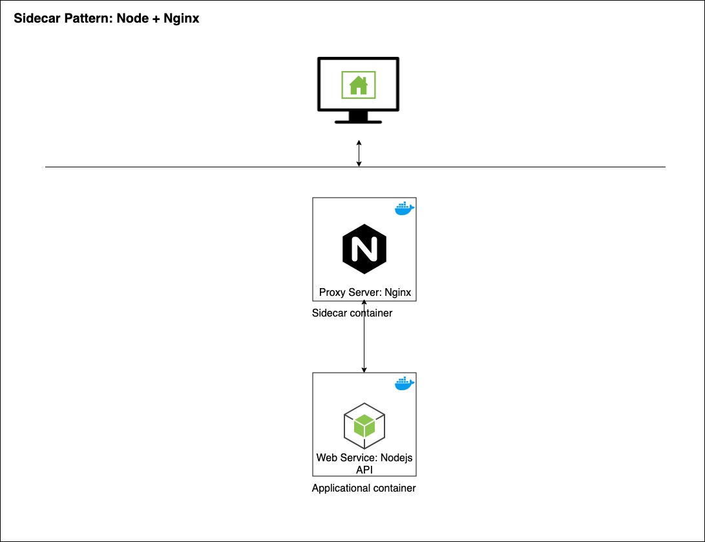

# Sidecar Pattern: Proxy Server

This repository implements a Nodejs behind a proxy server using the [sidecar pattern](https://blog.davemdavis.net/2018/03/13/the-sidecar-pattern/).

## Goals

* Setup the deployment process of
  * Applicational container: Nodejs API running [JSON Placeholder](https://github.com/typicode)
  * Sidecar container running [Nginx](https://www.nginx.com/)
* Successfully deploy application on a Kubernetes cluster

## Non-Goals

* Implement a RESTfull API / webservice from scratch
* Implement load balancing with nginx

## How to setup

1 - Clone this repository

    git@github.com:flowck/sidecar-pattern-node-behind-nginx.git

2 - Build it

    docker-compose build

3 - Run it

    docker-compose up

4 - Explore

[http://localhost:8080]